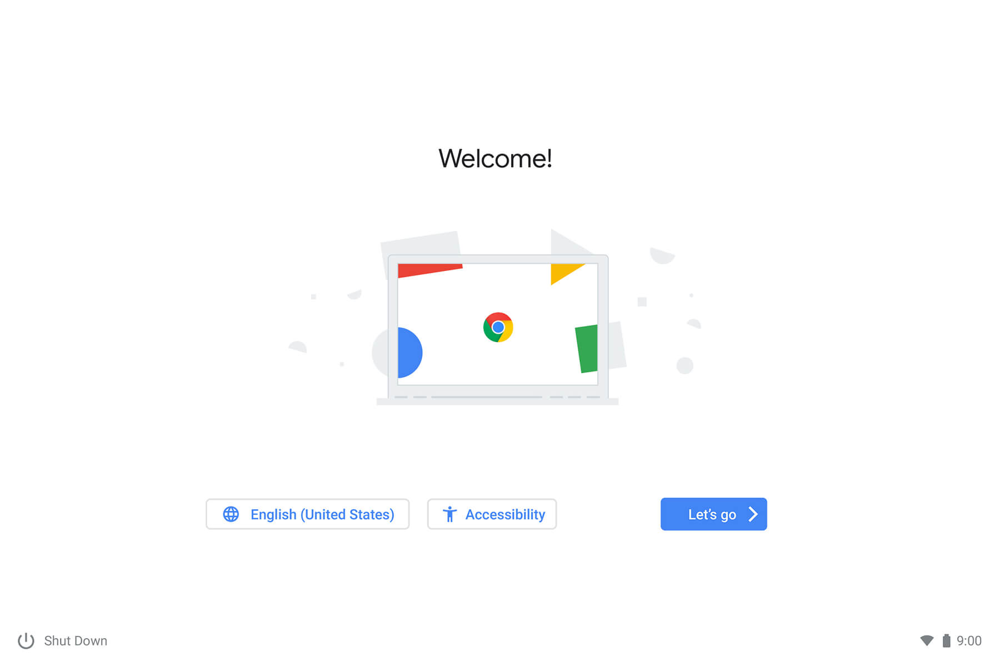
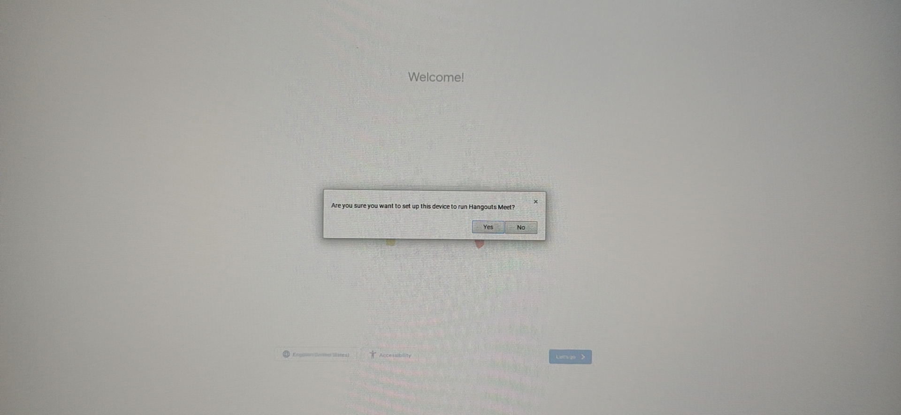

# 1. Creating the recovery disk

If your device is in [this list](../meetHardwareDevices.md) download on Chrome [this extension](https://chrome.google.com/webstore/detail/meet-compute-system-recov/odkacekibiibhidpiopcmgbgebkeoced) for Meet Compute Systems, otherwise use [this one](https://chrome.google.com/webstore/detail/chromebook-recovery-utili/pocpnlppkickgojjlmhdmidojbmbodfm) for generic ChromeOS devices.

Open the extension, connect the USB drive and follow the instructions on screen to create a recovery USB drive.

# 2. System recovery

> [!IMPORTANT]
> Before continuing, remove **all** USB devices from the Chromebox except a keyboard.

Follow the [official steps](https://support.google.com/a/answer/10562922?hl=en#zippy=%2Cstep-enter-recovery-mode) from Google to reinstall ChromeOS, starting from `Step 2: Enter recovery mode`.

When ChromeOS is completely reinstalled you'll be greeted with the welcome screen:

**Do not continue with the setup**, instead press `Ctrl + Alt + H`, a popup will appear:

Select `Yes`.

The Chromebox will then set up for use in Meetings mode. Ignore the discovery of USB devices (mouse) and continue with the keyboard. Log in as a Google Workspace admin and complete the setup.

Once you're on the main screen of Meet mode you can connect a mouse for easier navigation.