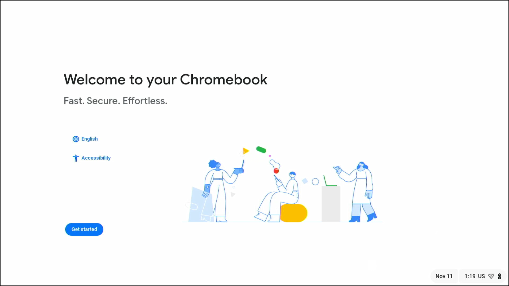
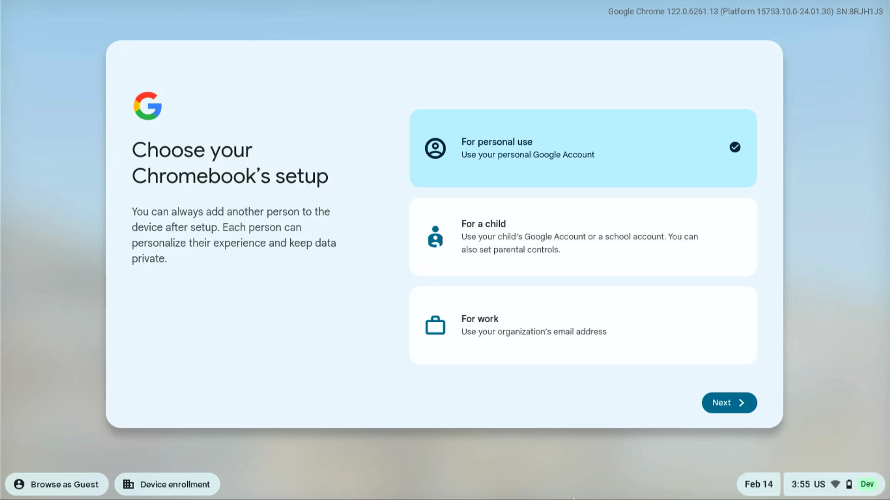
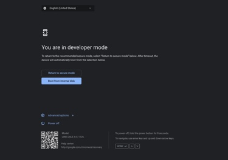

# 1. Creating a recovery disk

If your device is in [this list](../meetHardwareDevices.md) download on Chrome [this extension](https://chrome.google.com/webstore/detail/meet-compute-system-recov/odkacekibiibhidpiopcmgbgebkeoced) for Meet Compute Systems, otherwise use [this one](https://chrome.google.com/webstore/detail/chromebook-recovery-utili/pocpnlppkickgojjlmhdmidojbmbodfm) for generic ChromeOS devices.

Open the extension, connect the USB drive and follow the instructions on screen to create a recovery USB drive.

# 2. System recovery

> [!IMPORTANT]
> Before continuing, remove **all** USB devices from the Chromebox except a keyboard. Also disconnect the device from internet.

Follow the [official steps](https://support.google.com/a/answer/10562922?hl=en#zippy=%2Cstep-enter-recovery-mode) from Google to reinstall ChromeOS, starting from `Step 2: Enter recovery mode`.

When ChromeOS is completely reinstalled you'll be greeted with the welcome screen:



**Do not continue with the setup**, instead turn off the device from the menu in the bottom right.

## 2.1. Enabling developer mode

Enter recovery mode again by pressing and keeping pressed the recovery button, then turn the device on. When you see the recovery screen, press `Ctrl + D` to activate developer mode, then press the recovery button to restart the device.

> [!IMPORTANT]
> If after the restart you're immediately prompted with a screen asking you to return to a protected mode, press `Confirm`. The Chromebox will reboot into ChromeOS.
>
> Make sure that the device is no longer managed ([deprovision](./index.md#deprovisioning) it), there is no account signed in and then reach this screen **without continuing** with the setup:
> 
> 
> 
> Turn off the device from the menu in the bottom right, then retry enabling developer mode.

After the restart you'll be greeted with this screen:



Select `Boot from internal disk` and press `Enter`. The device will set up for use in developer mode, this step may take up to 5 minutes (there should be a timer in the upper left corner). After the setup the device will reboot, select `Boot from internal disk` and press `Enter` again.

When you reach the welcome screen press `Ctrl + Alt + F2` to enter the console.

## 2.2. Enabling Meet mode

Login as `root` with no password, write this command:

```sh
vpd -i RW_VPD -s "oem_device_requisition"="remora"
```

> [!NOTE]
> The keyboard layout defaults to US in the console, double check that what you're writing is correct.
> 
> CAPS LOCK is not recognised as a key.

And press `Enter`. There could be some errors shown but ignore them.

Finally restart the device with the following command:

```
sudo reboot
```

On reboot, select `Return to secure mode`, then `Confirm`, the device will reboot once again.

# 3. Final touches

Once rebooted you'll land on the welcome screen. Change the language and keyboard layout (from the menu in the bottom right) as needed, then log in as a Google Workspace admin and complete the setup.

The time zone on the device may be wrong, it should automatically correct itself when you link a calendar to the device, otherwise manually change it via the Google Workspace web page.

> [!TIP]
> If you forget to set the correct keyboard layout during the setup, you can change it afterwards by pressing `Ctrl + Shift + Space` until you reach the desired one (it should be only one press as the installed layouts usually are just US and yours).