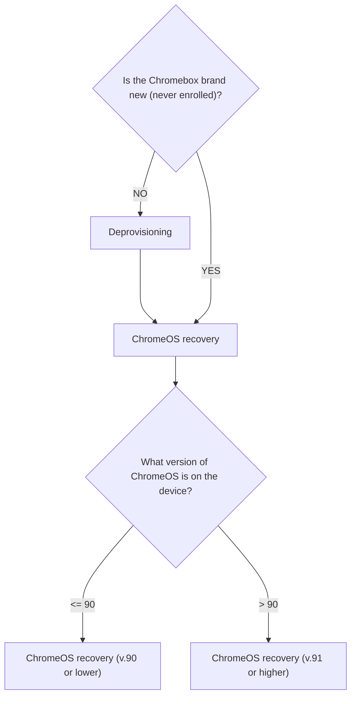

# Prerequisites

You will need the following items:
- A Chromebox device;
- A USB drive (8GB or larger) for ChromeOS recovery image;
- A computer with Chrome (browser) installed;
- A valid Enterprise Upgrade license for each device you want to use in Meet mode;

# Introduction

This documentation can be used in the following cases:
1. The Chromebox is a new device that needs to be used in Meetings mode;
2. The Chromebox was a Meetings device in use that suffered a hardware or software failure (corrupt OS, failed disk, etc.) and needs to return to Meetings mode;

In the former you can skip the `Deprovisioning` step, in the latter you can't.

The following flow chart will sum up the entire procedure:

# Deprovisioning

1. Log in to your Google admin dashboard;
2. Find the Chromebox you want to deprovision;
3. Click on the device and click `DEPROVISION` on the menu on the left;
4. Choose if you want to remove or keep the data, check the box to confirm the actions and select `Same model replacement`.

All done here, proceed to the recovery step.

# ChromeOS recovery

Pick one of the two following guides, depending on the version of ChromeOS available for your device:
- [ChromeOS recovery for version 90 or lower](./chromeosV90orLower.md);
- [ChromeOS recovery for version 91 or higher](./chromeosV91orHigher.md);