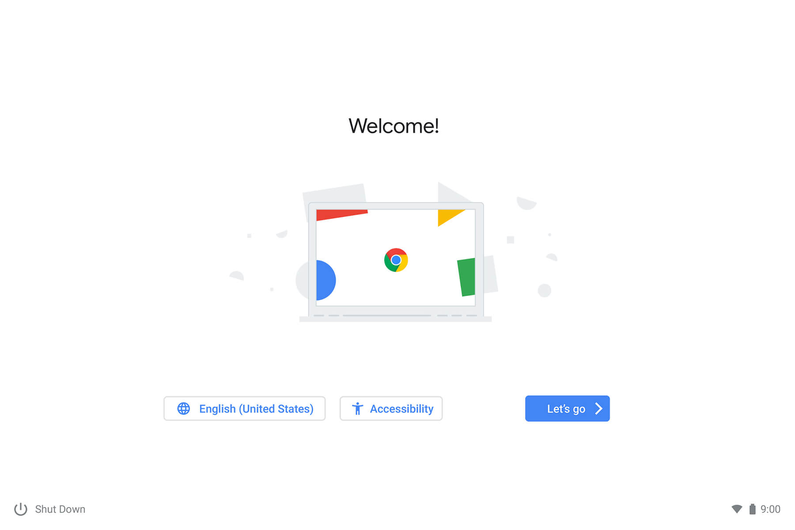
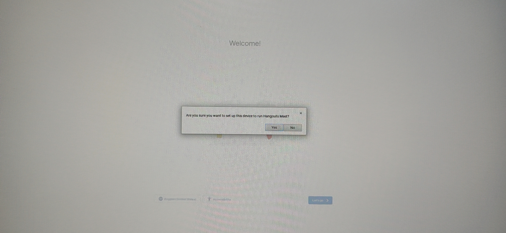

# 1. Creare il disco di ripristino

Se il dispositivo è in [questa lista](../meetHardwareDevices.md) scaricare su Chrome [questa estensione](https://chrome.google.com/webstore/detail/meet-compute-system-recov/odkacekibiibhidpiopcmgbgebkeoced) per i Meet Compute Systems, altrimenti si scarichi [quest'altra](https://chrome.google.com/webstore/detail/chromebook-recovery-utili/pocpnlppkickgojjlmhdmidojbmbodfm) per dispositivi ChromeOS generici.

Aprire l'estensione, collegare la chiavetta USB e seguire le istruzioni a schermo per creare la chiavetta di ripristino.

# 2. Recovery di sistema

> [!IMPORTANT]
> Prima di continuare, rimuovere **tutti** i dispositivi USB collegati al Chromebox ad eccezione di una tastiera.

Seguire i [passi ufficiali](https://support.google.com/a/answer/10562922?hl=en#zippy=%2Cstep-enter-recovery-mode) di Google per reinstallare ChromeOS, partendo da `Step 2: Enter recovery mode`.

Quando ChromeOS si è completamente reinstallato, si vedrà la schermata di benvenuto:

**Non continuare con il setup**, ma premere `Ctrl + Alt + H`, dopodiché apparirà un popup:

Selezionare `Yes` o `Si`.

Il Chromebox si imposterà in modalità Meetings. Ignorare la ricerca di dispositivi USB (mouse) e continuare con la tastiera. Fare login come amministratore Google Workspace e completare il setup.

Una volta che ci si trova nella schermata principale della modalità Meet si può collegare un mouse per un più facile utilizzo.