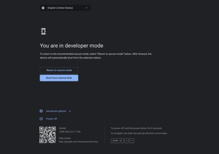

# 1. Creare il disco di ripristino

Se il dispositivo è in [questa lista](../meetHardwareDevices.md) scaricare su Chrome [questa estensione](https://chrome.google.com/webstore/detail/meet-compute-system-recov/odkacekibiibhidpiopcmgbgebkeoced) per i Meet Compute Systems, altrimenti si scarichi [quest'altra](https://chrome.google.com/webstore/detail/chromebook-recovery-utili/pocpnlppkickgojjlmhdmidojbmbodfm) per dispositivi ChromeOS generici.

Aprire l'estensione, collegare la chiavetta USB e seguire le istruzioni a schermo per creare la chiavetta di ripristino.

# 2. Recovery di sistema

> [!IMPORTANT]
> Prima di continuare, rimuovere **tutti** i dispositivi USB collegati al Chromebox ad eccezione di una tastiera.

Seguire i [passi ufficiali](https://support.google.com/a/answer/10562922?hl=en#zippy=%2Cstep-enter-recovery-mode) di Google per reinstallare ChromeOS, partendo da `Step 2: Enter recovery mode`.

Quando ChromeOS si è completamente reinstallato, si vedrà la schermata di benvenuto:


**Non continuare con il setup**, ma spegnere il dispositivo dal menù in basso a destra.

## 2.1. Abilitare la modalità sviluppatore

Entrare nuovamente in modalità recovery premendo e tenendo premuto il pulsante di recovery e poi accendere il dispositivo. Quando si vede la schermata di recovery, premere `Ctrl + D` per attivare la modalità sviluppatore dopodiché premere di nuovo il pulsante di ripristino per riavviare il Chromebox.

> [!IMPORTANT]
> Se dopo il riavvio ci fosse una schermata che invita a tornare in modalità protetta, premere `Conferma`. Il Chromebox si riavvierà in ChromeOS.
> 
> Assicurarsi che il dispositivo non sia più gestito (si faccia [deprovisioning](./index.md#deprovisioning)), che non ci sia nessun account attualmente in uso, poi raggiungere questa schermata **senza continuare** nella configurazione:
> 
> 
> 
> Spegnere il dispositivo dal menù in basso a destra e riprovare ad abilitare la modalità sviluppatore.

A seguito del riavvio, si vedrà la seguente schermata:



Selezionare `Avvia da disco interno` e premere `Enter`. Il dispositivo si imposterà in modalità sviluppatore; questo passo può richiedere fino a 5 minuti (c'è un timer in alto a sinistra). Alla fine del setup il dispositivo si riavvierà, selezionare `Avvia da disco interno` e premere `Enter` di nuovo.

Quando si raggiunge la schermata di benvenuto, premere `Ctrl + Alt + F2` per accedere alla console.

## 2.2. Abilitare la modalità Meet

Fare login come `root` senza alcuna password, e scrivere questo comando:

```sh
vpd -i RW_VPD -s "oem_device_requisition"="remora"
```

> [!NOTE]
> Il layout della tastiera nella console è automaticamente US, controllare di scrivere le cose giuste.
> 
> Il BLOC MAIUSC non è un tasto riconosciuto.

E premere `Enter`. Ci potrebbero essere degli errori a schermo, ma si possono ignorare.

Infine riavviare il dispositivo con il seguente comando:

```
sudo reboot
```

Al riavvio, selezionare `Torna a modalità protetta`, poi `Conferma`; il dispositivo si riavvierà ancora una volta.

# 3. Ultimi ritocchi

A seguito del riavvio, si arriverà alla schermata di benvenuto. Cambiare la lingua e il layout della tastiera (dal menù in basso a destra) a piacere, poi fare login come amministratore Google Workspace e completare il setup.

Il fuso orario sul Chromebox potrebbe essere sbagliato, dovrebbe automaticamente cambiare assegnando un calendario al dispositivo, altrimenti si può cambiare manualmente tramite la console di amministrazione Google Workspace.

> [!TIP]
> Se ci si dimentica di impostare il layout della tastiera corretto durante la fase di setup, si può cambiare in seguito premendo `Ctrl + Shift + Space` fino a raggiungere il layout desiderato (si dovrebbe premere una volta sola visto che i layout installati sono due, US e il vostro).