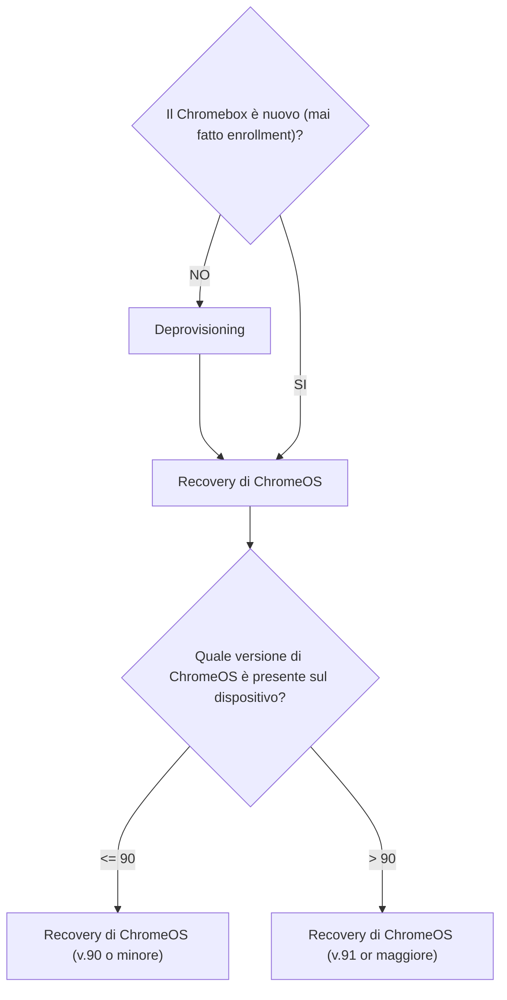

# Pre-requisiti

Serviranno le seguenti cose:
- Il dispositivo Chromebox;
- Una chiavetta USB (8GB o di più) per l'immagine di recovery di ChromeOS;
- Un computer con Chrome (browser);
- Una licenza Enterprise Upgrade valida per ciascun dispositivo che si vuole usare in modalità Meet;

# Introduzione

La seguente documentazione può essere usata nei casi seguenti:
1. Il Chromebox è un dispositivo nuovo che si vuole usare in modalità Meetings;
2. Il Chromebox era un dispositivo usato in modalità Meetings che ha avuto guasti hardware o software (OS corrotto, rottura del disco, ecc.) e deve tornare in modalità Meetings;

Nel primo caso si può saltare il passo `Deprovisioning`, nel secondo no.

Il seguente diagramma di flusso riassume la procedura:

# Deprovisioning

1. Effettuare login nella pagina di amministrazione Google;
2. Cercare il Chromebox su cui fare deprovisioning;
3. Cliccare sul dispositivo e cliccare `DEPROVISION` dal menù a sinistra;
4. Scegliere se si vogliono mantenere o meno i dati, spuntare la casella per confermare le azioni e selezionare `Same model replacement`.

Completato questo, procedere al passo della recovery.

# ChromeOS recovery

Scegliere una delle seguenti guide a seconda della versione di ChromeOS disponibile per il Chromebox:
- [Recovery di ChromeOS per versione 90 o minore](./chromeosV90orLower.md);
- [Recovery di ChromeOS per versione 91 o maggiore](./chromeosV91orHigher.md);